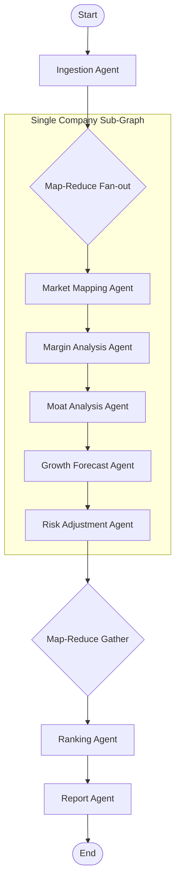

# AI Factory Growth Equity Research Network

An Agentic Network built on **LangGraph** designed to systematically identify, score, and rank public companies positioned to achieve superior equity growth driven by the build-out of **AI Factories** and hyperscale data centers.

---

## 🚀 Overview

This repository automates equity research for the **AI Factory infrastructure supply chain** (the "picks and shovels" vendors) receiving massive Capital Expenditure (Capex). It evaluates companies based on their exposure to compute, networking, power infrastructure, cooling systems, and engineering/construction, filtering out builder/spender hyperscalers (e.g., Microsoft, Alphabet) to focus on growth targets.

The system executes a parallelized **Map-Reduce** pipeline that:
1. **Ingests** a seed list of target tickers.
2. **Evaluates** each company individually inside an isolated single-company sub-graph.
3. **Scores** the company's economics using a blend of deterministic math and targeted LLM evaluations.
4. **Ranks** and outputs a Top 20 ranking report.

---

## 📈 Core Growth Evaluation Formula

To ensure reproducible, mathematically sound, and objective rankings, the network calculates the **Total AI Factory Growth Score (TAFGS)**:

$$\text{TAFGS} = (\text{Moat Score} \times \text{Operating Margin Score}) \times \text{Forecast AI-Driven Growth}$$

### 1. Moat Score (0–5)
Qualitative defensibility is parsed by an LLM into distinct boolean criteria, which are then summed mathematically in Python to avoid monolithic LLM scoring bias:
* **Architectural lock-in** (e.g., CUDA, proprietary networking)
* **Ecosystem dominance** (design wins, reference architectures)
* **Switching costs** / standard-setting influence
* **Scarcity/bottleneck position** in the supply chain

### 2. Operating Margin Score (1–5)
Bypasses the LLM entirely. Sourced deterministically from actual TTM operating margins:

| Operating Margin (%) | Operating Margin Score |
| :--- | :--- |
| **> 40%** | 5 |
| **30% – 40%** | 4 |
| **20% – 30%** | 3 |
| **10% – 20%** | 2 |
| **< 10%** | 1 |

### 3. Forecast AI-Driven Growth (3-Year Revenue CAGR %)
Analyzed by the growth agent based on contract backlogs, management guidance, and hyperscaler commitment trends.

---

## 🏗️ Architecture & Modular Agents

The graph is designed as a parent-child map-reduce network to isolate company-level failures and support concurrent evaluations.



### Modular Agent Roles
* **Market Mapping Agent**: Classifies companies into their respective AI Factory supply chain roles (Compute, Networking, Power, Cooling, Construction).
* **Company Ingestion Agent**: Filters out hyperscalers and non-eligible targets from the seed list.
* **Moat Analysis Agent**: Assesses competitive moats and outputs boolean criteria.
* **Margin Analysis Agent**: Normalizes TTM operating margins.
* **Growth Forecast Agent**: Estimates the 3-Year revenue CAGR driven by AI Factory demand.
* **Risk Adjustment Agent**: Discounts scores based on cyclicality, execution, or customer concentration.
* **Ranking Agent**: Computes the final TAFGS score in pure Python.
* **Report Agent**: Renders the final Markdown and PDF output.

---

## 📁 Repository Structure

```text
├── CONTEXT.md                 # Ubiquitous domain terminology & concepts
├── PROJECT_SPEC.md            # Detailed project specification
├── requirements.txt           # Python dependencies
├── docs/
│   └── adr/                   # Architectural Decision Records (ADRs)
├── src/
│   ├── agents/                # LangGraph nodes and orchestration logic
│   │   ├── graph.py           # Parent map-reduce and sub-graph builds
│   │   ├── ingestion.py
│   │   ├── market.py
│   │   ├── margin.py
│   │   ├── moat.py
│   │   ├── growth.py
│   │   ├── risk.py
│   │   ├── ranking.py
│   │   └── report.py
│   └── schema/                # Pydantic data schemas
│       ├── company.py         # CompanyProfile and Enums
│       ├── state.py           # ParentState and reducer schemas
│       └── ...
└── tests/                     # Unit and integration test suite
```

---

## 🛠️ Getting Started

### Prerequisites
* Python 3.10+
* An OpenAI API Key (configured in your environment as `OPENAI_API_KEY`)

### Installation

1. Clone the repository.
2. Create and activate a virtual environment:
   ```bash
   python -m venv venv
   source venv/bin/activate  # On Windows: venv\Scripts\activate
   ```
3. Install dependencies:
   ```bash
   pip install -r requirements.txt
   ```

### Running Tests

Ensure all components and agent nodes are behaving correctly by running the test suite:
```bash
pytest
```

---

## 📖 Key Architectural Decisions

* **[Map-Reduce State Management]** - Isolates single-company pipeline execution into a sub-graph to prevent massive context payloads and handle individual company-level failures gracefully.
* **[Deterministic Scoring]** Restricts the LLM from outputting direct scoring numbers. Margin scoring is done via pure Python, and Moat scoring sums boolean criteria generated by the LLM.
